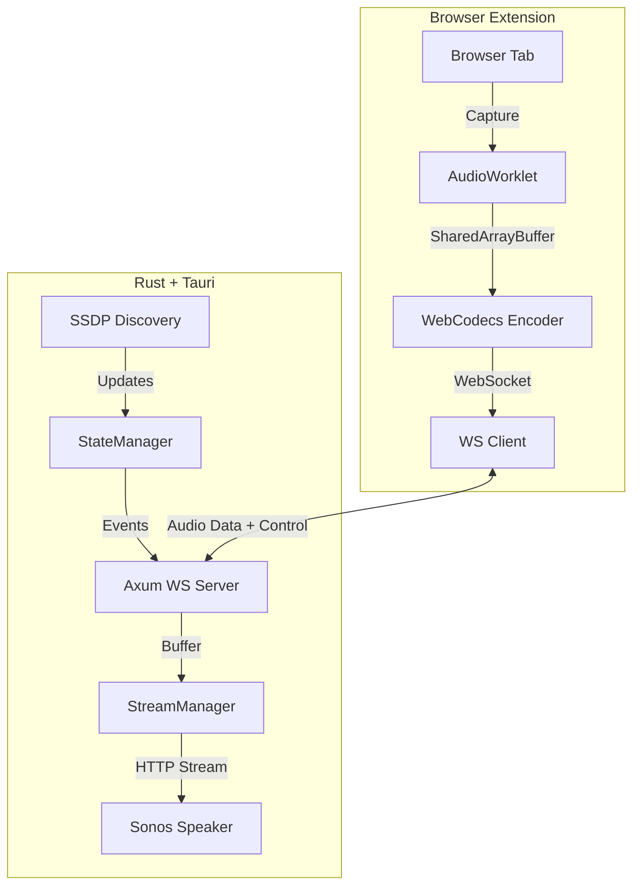

# Thaumic Cast Architecture

## Core Purpose

Thaumic Cast acts as a bridge between the browser and Sonos speakers. It captures audio from browser tabs and streams it locally to Sonos devices using the UPnP protocol.

**Key Capabilities:**

- **Multi-Cast:** Stream different tabs to different Sonos groups simultaneously.
- **Low Latency:** Uses WAV/LPCM by default for near-instant playback.
- **Modern Pipeline:** Uses `AudioWorklet`, `WebCodecs`, and `SharedArrayBuffer` for high-performance audio processing.

## System Overview

## Monorepo Structure

We use a Monorepo workspace managed by `bun`.

- **`apps/desktop`**: The "Server".
  - **Tech:** Rust (Tauri), Axum (HTTP/WS), Tokio (Async), Preact (UI).
  - **Role:** Discovers speakers, hosts the audio stream HTTP server, manages the WebSocket ingest.
- **`apps/extension`**: The "Client".
  - **Tech:** Vite, Preact, Manifest V3, WebCodecs.
  - **Role:** Captures tab audio, encodes it, sends it to Desktop. Handles multiple concurrent streams.
- **`packages/protocol`**: The "Contract".
  - **Tech:** TypeScript.
  - **Role:** Shared Types, Interfaces, Zod schemas, and Enums used by both apps to ensure type safety across the WebSocket boundary.
- **`packages/ui`**: The "Look".
  - **Tech:** Preact, CSS Modules.
  - **Role:** Shared design system, colors, and UI components.

## Audio Pipeline (The "Modern" Approach)

1.  **Capture:** `chrome.tabCapture` gets a `MediaStream` from a tab.
2.  **Extraction:** An `AudioWorklet` extracts raw PCM samples on a dedicated audio thread.
3.  **Transport (Internal):** Samples are written to a `SharedArrayBuffer` (Ring Buffer).
4.  **Encoding:** An Offscreen Document reads the Ring Buffer and uses `AudioEncoder` (WebCodecs) to compress (AAC) or format (WAV) the audio.
5.  **Transport (Network):** Encoded frames are sent via WebSocket to the Desktop App.
6.  **Buffering:** The Desktop App buffers a small amount (to handle jitter) in a `VecDeque`.
7.  **Playback:** The Desktop App serves the buffer as an infinite HTTP stream (`Transfer-Encoding: chunked`) to the Sonos speaker.

## Multi-Cast Handling

To support streaming Tab A -> Speaker A and Tab B -> Speaker B:

1.  **Extension:**
    - The Background Service Worker manages a map of `Map<TabId, StreamSession>`.
    - Each `StreamSession` has its own `AudioContext`, `Encoder`, and `WebSocket` connection.
    - The Offscreen Document is designed to handle multiple parallel pipelines.
2.  **Desktop:**
    - The `StreamManager` identifies streams by a unique `StreamUUID`.
    - The HTTP Server exposes dynamic routes: `/stream/:stream_id/live.wav`.
    - When a WebSocket connects, it performs a handshake to establish which `StreamUUID` it is feeding.
