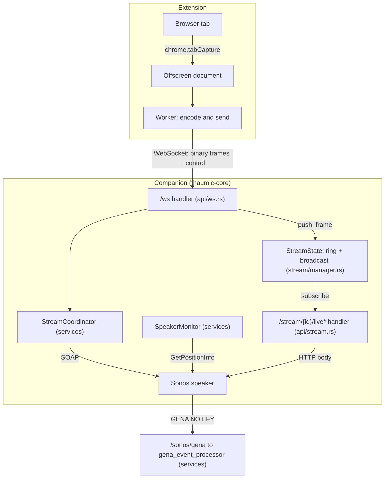

# Thaumic Cast Architecture

Thaumic Cast plays the audio of a browser tab on Sonos speakers. A browser extension captures and
encodes the audio and sends it to a companion process on the local network. The companion serves it
as an HTTP stream and tells the speakers, over UPnP, to play that stream.

This document is a map: what the parts are, where each lives and why it is shaped the way it is. The
details are in the module documentation (`//!` comments) of the files named here. Paths are relative
to the repository root unless they start with a module name, in which case they are relative to
`packages/thaumic-core/src/`.

## Components

| Path                       | What it is                                                                                                                 |
| -------------------------- | -------------------------------------------------------------------------------------------------------------------------- |
| `apps/extension`           | Chrome MV3 extension (Preact). The client: captures tab audio, encodes it, sends it, and shows the popup and options page. |
| `packages/thaumic-core`    | Rust library. The whole companion: HTTP and WebSocket API, stream serving, Sonos control, speaker monitor.                 |
| `apps/desktop`             | Desktop shell: a Tauri app (Rust in `src-tauri`, Preact window in `src`) around `thaumic-core`.                            |
| `apps/server`              | Headless shell: a single binary around `thaumic-core`, configured by file, flags and environment.                          |
| `packages/thaumic-capture` | WASAPI process-loopback capture for Windows, used by the desktop shell. A stub on other platforms.                         |
| `apps/wasapi-capture`      | A diagnostic CLI over `thaumic-capture`. Not part of the product.                                                          |
| `packages/protocol`        | TypeScript types and Zod schemas for the WebSocket messages and events. Its `fixtures/` are also read by core's tests.     |
| `packages/shared`          | TypeScript utilities (the logger).                                                                                         |
| `packages/ui`              | Shared Preact components and the theme CSS.                                                                                |

"The companion" means whichever shell is running: the desktop app or the server. Both run the same
core; they differ only in how they are configured and what they show.

## How audio flows

```mermaid
graph TD
    subgraph Extension
        Tab[Browser tab] -->|chrome.tabCapture| Offscreen[Offscreen document]
        Offscreen --> Worker[Worker: encode and send]
    end

    subgraph Companion["Companion (thaumic-core)"]
        WS["/ws handler (api/ws.rs)"] -->|push_frame| State["StreamState: ring + broadcast (stream/manager.rs)"]
        State -->|subscribe| HTTP["/stream/{id}/live* handler (api/stream.rs)"]
        Coordinator["StreamCoordinator (services)"] -->|SOAP| Speaker
        Monitor["SpeakerMonitor (services)"] -->|GetPositionInfo| Speaker
    end

    Worker -->|WebSocket: binary frames + control| WS
    WS --> Coordinator
    HTTP -->|HTTP body| Speaker[Sonos speaker]
    Speaker -->|GENA NOTIFY| Gena["/sonos/gena to gena_event_processor (services)"]
```

1. **Capture.** The background service worker gets a tab's stream id with `chrome.tabCapture`
   (`apps/extension/src/background/handlers/cast.ts`) and hands it to the offscreen document, which
   owns one `StreamSession` per cast (`offscreen/stream-session.ts`).
2. **Encode and send.** Each session runs a worker that owns the cast's WebSocket. A PCM tab cast
   reads `AudioData` from a `MediaStreamTrackProcessor` and sends 16-bit frames
   (`offscreen/audio-relay.worker.ts`). AAC and FLAC go through an `AudioWorklet`
   (`offscreen/pcm-processor.ts`), a `SharedArrayBuffer` ring (`offscreen/ring-buffer.ts`) and a
   WebCodecs encoder (`offscreen/audio-consumer.worker.ts`, `offscreen/encoders/`). The
   socket code both workers share is `offscreen/worker-base.ts`.
3. **Handshake.** The worker sends `HANDSHAKE` with its encoder config. `api/ws.rs` validates it,
   creates a stream through `StreamCoordinator::create_stream` and binds it to the connection; the
   stream is removed when the connection goes away. Core encodes nothing: what arrives is what is
   served.
4. **Ingest.** Every binary WebSocket message is one frame. `StreamState::push_frame`
   (`stream/manager.rs`) stamps it with its arrival time, appends it to a bounded ring and sends it
   on a broadcast channel, both under one lock so that `subscribe()` never sees a frame twice.
5. **Start playback.** On the first frame the client is sent `STREAM_READY` and answers with
   `START_PLAYBACK` naming the speakers. `StreamCoordinator` (`services/stream_coordinator.rs`)
   gives each speaker the stream's URL (`SetAVTransportURI`, `Play`) through the `sonos` module.
   Speaker commands run on a per-connection control worker in `api/ws.rs`, so a slow SOAP call
   never holds up frame ingest.
6. **Serve.** The speaker fetches the URL. `api/stream.rs` subscribes to the stream, getting the
   ring's contents (the prefill) and a live receiver, and builds the response body from them. This
   is where PCM and the compressed codecs part ways (see below).
7. **Watch.** The first real frame a speaker's connection serves starts that speaker's playback
   epoch and registers the connection with the speaker monitor, which then polls the speaker.

Besides the per-cast sockets, the extension keeps one control WebSocket
(`offscreen/control-connection.ts`) for state, events, volume and mute. One companion serves several
extensions; `api/ws_connection.rs` records which connection created which stream, so a client sees
its own sessions in full and other clients' only as busy speakers.

On Windows the desktop app can also capture the whole browser itself (`START_BROWSER_CAPTURE`). The
extension then sends no audio: a WASAPI source from `thaumic-capture`, reached through the traits in
`capture/`, pushes PCM into the stream (`StreamCoordinator::start_capture_stream`). It is offered
only to clients on the companion's own machine.

## Core's modules

| Module               | Holds                                                                                                                                                         |
| -------------------- | ------------------------------------------------------------------------------------------------------------------------------------------------------------- |
| `api`                | The Axum router and server start (`mod.rs`), REST handlers (`http.rs`), the WebSocket handler (`ws.rs`, `ws_connection.rs`), the stream handler (`stream.rs`) |
| `services`           | Orchestration: `stream_coordinator` (with `continuation`), `speaker_monitor`, `topology_monitor`, `discovery_service`, `gena_event_processor`, sync groups    |
| `stream`             | The data plane: stream state, codec facts, the PCM cadence and playout, delivery tracking, framing, the TCP link probe, URLs                                  |
| `sonos`              | UPnP: SOAP, playback and volume commands, zone topology, SSDP and mDNS discovery, GENA subscriptions and parsing                                              |
| `events`             | The event types sent to clients, the `EventEmitter` trait and the bridge to the WebSocket broadcast channel                                                   |
| `model`              | Small value types shared by all of the above: drift mode, head start and monitor settings, speaker notice, playout timeline, topology change                  |
| `state`              | `Config`, `StreamingConfig`, `SonosState` (groups and transport states), manual speakers                                                                      |
| `companion_settings` | Resolves the three speaker settings from flag, environment, file and default, once at start-up                                                                |
| `context`            | `NetworkContext`: the port, the advertised address, URL building                                                                                              |
| `bootstrap`          | The composition root: builds every service and wires them together                                                                                            |
| `streaming_runtime`  | A separate Tokio runtime on high-priority threads, for the HTTP server                                                                                        |
| `capture`            | Traits for a platform audio source and sink, and capture diagnostics                                                                                          |
| others               | `protocol_constants`, `error`, `artwork`, `runtime` (task spawner), `mdns_advertise`, `utils`                                                                 |

### Layering

From the top down: `api`, then `services`, then `stream` and `sonos`, then `model` and
`protocol_constants`.

- **`api`** is the top. Handlers are thin and call services. Nothing outside `api` imports it,
  except `bootstrap`, which constructs the `WsConnectionManager`.
- **`services`** imports `stream`, `sonos`, `events`, `state`, `context` and `model`. It never
  imports `api`.
- **`stream`** imports `model`, `protocol_constants`, the `EventEmitter` trait and `LinkQuality`
  from `events`, `StreamingConfig` from `state`, and `utils`. It never imports `services`, `sonos`
  or `api`. What the services need to tell a connection, or learn from it, goes through types that
  `stream` owns: `ConnectionTap`, `MonitorRegistrar`, `RateControl`, `PlayoutEvents`.
- **`sonos`** imports the value types that describe a stream (`AudioCodec`, `AudioFormat`,
  `StreamMetadata`, `same_stream`) and nothing from `services`, `events`, `state` or `api`.
- **`events`** imports `model` and `sonos` (`SonosEvent` is defined in `sonos::gena` and re-exported
  here). `CompanionAudio::from_config` also reads `state::Config`.
- **`model`** is a leaf. Its rule, stated in `model/mod.rs`: only `std`, `serde`, `log` and
  `protocol_constants`. Types moved here are still re-exported from the modules they came from, so
  older paths resolve.
- **`capture`** imports only `AudioFormat` from `stream`.

`companion_settings` takes the environment variable names and value parsers for its settings from
`model`, so it imports nothing above it. It and `state` name each other: it writes the resolved
values into `state::Config`, and `Config` records where each came from as
`companion_settings::SettingOrigins`.

### Per-codec decisions

Everything the server decides from a stream's codec alone is one table, `AudioCodec::facts()` in
`stream/codec.rs`: MIME type, the URL form a speaker is given, ICY support, container header size,
teardown order, and `paced`, which selects the PCM serving path. Code that needs to branch on the
codec reads the fact named for its reason.

## The PCM path

A Sonos speaker treats a WAV stream as a file that must keep arriving and holds very little of it
ahead of its playhead. Most of the stream code exists to keep that small reserve from running out.
The stream handler in `api/stream.rs` is a sequence of named phases (`admit`, `fetch_framing`,
`route_segment`, the first-connection wait, `subscribe()`, `connection_guard`, `playout_stats`,
`playback_hooks`, `body_pipeline`, `assemble_response`); the order of the wait, the resume `Play`
and `subscribe()` is deliberate and field-proven.

- **Admission.** `admit` finds the stream and decides what the peer is to it (`StreamAccess`): a
  speaker the stream is playing on, this machine, or an unlisted reader, which is served on a budget
  or refused under `strict_stream_access`. Only a speaker is monitored; a speaker or a player on
  this machine is tracked as playback (an epoch, resumes); an unlisted reader is neither.
- **First-connection wait.** A new PCM connection is held until the stream is old enough for the
  ring to contain the jitter buffer plus the head start (`pcm_prefill_delay`). A resume, meaning the
  same address has already started an epoch on this stream, skips the wait.
- **Connect burst (speaker head start).** `CadenceConfig::new` (`stream/cadence.rs`) trims the
  prefill to the newest head start plus jitter buffer. The newest jitter buffer's worth is queued;
  everything older is the connect burst, sent as fast as the socket takes it before pacing starts,
  so the speaker begins with that much audio in hand. The setting is `Config::pcm_connect_burst_ms`
  (`model/head_start.rs`).
- **Cadence.** `create_wav_stream_with_cadence` emits one frame per tick of the stream's frame
  duration, whatever the input does: a queued frame if there is one, otherwise silence, with a
  short crossfade into and out of it. After an underrun it holds until the queue refills to the
  jitter buffer depth. `stream/ingest_gaps.rs` decides when repeated gaps in arrival are worth
  telling the client about.
- **Delivery tracking.** `stream/delivery.rs` holds the per-connection guard
  (`LoggingStreamGuard`) that logs a connection's lifecycle and summary for every codec, the watch
  over the first-connection wait, and the `EpochHook`. `stream/framing.rs` names how a body is
  delimited and what ended it. `stream/link.rs` reads the kernel's TCP statistics for the
  connection (retransmissions, round trip, unacknowledged bytes) and judges the link.
- **HTTP framing.** A PCM body is sent chunked with no `Content-Length` (`stream/pcm_http.rs`).
  The same file has the environment switches used for field experiments; they are not settings.
- **Playout chain and segments.** A speaker plays a WAV item to the length its header declares, and
  that length cannot exceed 4 GiB, so a long cast is served as consecutive segments, each under its
  own URL (`stream/uri.rs`: `live.wav`, then `live/{n}.wav`). One `PlayoutChain` per stream and
  speaker (`stream/playout.rs`) owns the cadence and outlives the connections that carry it: a
  `SegmentBody` polls the cadence while a connection is served, splits the frame that crosses the
  segment's end, and a park pump keeps the cadence drained between connections.
  `PlayoutRegistry::route` decides what each fetch is: a continuation of the playout, a side fetch that must not disturb it,
  an unsatisfiable range, or a new playout from the live edge.
- **Segment continuation.** Getting the speaker to fetch the next segment is the services' job
  (`services/stream_coordinator/continuation.rs`), driven by the `PlayoutEvents` the playout raises
  and by the speaker's GENA transport states. By default the next segment is queued as the
  speaker's next item (`SetNextAVTransportURI`) for a gapless switch; a speaker that does not
  follow is restarted on the next segment once it has stopped. For the length of the handoff, the
  transport states that are only the switch are kept from clients (`SonosState::hold_transport`).
- **Drift correction.** A speaker's sample clock differs from the companion's by tens of ppm, which
  slowly drains or fills its reserve. With correction on, the cadence passes every frame through a
  `RateAdapter` (`stream/rate_adapter.rs`), a fractional resampler that follows the rate left in the
  connection's `RateControl`. The rate comes from the `DriftController` in
  `services/speaker_monitor/control.rs`, a PI loop on the monitor's reserve estimates, bounded to
  ±150 ppm. Whether a connection gets an adapter is decided once, in `playback_hooks`
  (`connection_rate_control`); without one the captured buffers go out untouched.

### How compressed codecs differ

AAC, MP3 and FLAC connections are not paced. `body_pipeline` chains the whole prefill and then the
live receiver, as frames arrive, with no silence injection (zeros would corrupt the bitstream), no
first-connection wait, no head start, no segments and no drift correction. AAC and MP3 are given to
the speaker under `x-rincon-mp3radio://` and can carry ICY metadata (`stream/icy.rs`); FLAC is plain
HTTP with a `.flac` extension. Teardown order differs too: PCM closes the HTTP stream before the
SOAP stop, the compressed codecs stop first. The speaker monitor still watches these connections,
but their delivered bytes do not convert exactly to playback time, so they get no reserve estimate
(`ConnectionTap::measurable()` and `steerable()` in `stream/tap.rs` name that distinction).

## The speaker monitor

`services/speaker_monitor/` watches every speaker that fetches a stream. Monitoring follows the data
plane: the stream handler creates a `ConnectionTap` (`stream/tap.rs`) for a speaker's connection and
the epoch hook registers it with the monitor on the first frame served. Grouped members and
home-theatre satellites, which never fetch, are never polled.

What it measures, from `GetPositionInfo` polls every two to three seconds:

- **Reserve**: audio delivered to the speaker minus audio it has played. One poll bounds it to
  about a second; a window of dithered polls narrows that to tens of milliseconds
  (`bounds.rs`, `reserve.rs`). The low alarm uses the audio the speaker has acknowledged at the
  TCP level rather than what was handed to the socket (`tracker.rs`).
- **Clock rate**: the speaker's playback rate against the companion's clock (`clock_fit.rs`).
- **Latency**: stream time minus the speaker's position, for video sync
  (`session/video_sync.rs`). A client that asks for video sync in `START_PLAYBACK` gets latency
  events whatever the monitor setting says.

`monitor.rs` owns the I/O: the loop, the polls and their timeouts. `session.rs` and its children
hold what is kept per speaker and write the 30-second `[SpeakerMonitor]` report line
(`session/report.rs`). The modules beside them are pure and tested without I/O: `segment.rs` decides
when measurements stop being continuous, `transport_gate.rs` whether the speaker is playing,
`topology_diff.rs` what changed in the household.

**Notices are decided in one place**, `services/speaker_monitor/notice.rs`. Each report hands
`NoticeState::update` what it found, and the resulting `SpeakerNotice` (the type is in
`model/notice.rs`) rides the `speakerHealth` event (`session/health.rs`). Clients only choose words
and remember dismissals: `apps/extension/src/lib/speaker-notices.ts` and
`apps/desktop/src/lib/speaker-notices.ts`. The one notice decided elsewhere is audio reaching the
companion late, which concerns the stream rather than a speaker: `stream/ingest_gaps.rs`, sent as
the `ingestGaps` stream event.

## Sonos control and events

`sonos/` is the UPnP layer. Its capabilities are traits in `sonos/traits.rs` (`SonosPlayback`,
`SonosTopology`, `SonosDiscovery`, `SonosVolumeControl`, and the combinations `SonosTopologyClient`
and `SonosClient`), implemented by `SonosClientImpl`, so services can be tested against fakes.
Speakers are found by SSDP and mDNS (`sonos/discovery/`) or added by IP address.
`services/topology_monitor.rs` refreshes the
zone topology and manages GENA subscriptions; speakers post their notifications to `/sonos/gena`,
and `services/gena_event_processor.rs` turns them into `SonosState` updates and events.

Services emit through the `EventEmitter` trait. `BroadcastEventBridge` (`events/bridge.rs`) puts
events on the broadcast channel every WebSocket connection reads, and forwards them to an optional
external emitter, which the desktop shell uses for its window.

## Settings ownership

| Owner     | Settings                                                                                                                | Where they live                                                                                                  | When they take effect             |
| --------- | ----------------------------------------------------------------------------------------------------------------------- | ---------------------------------------------------------------------------------------------------------------- | --------------------------------- |
| Per cast  | Codec, bitrate, sample rate, channels, bit depth, smoothing (jitter buffer), frame size; speakers, sync, video sync     | Stored by the extension, resolved by `lib/audio-resolver.ts`, sent in `HANDSHAKE` and `START_PLAYBACK`           | The cast they are sent with       |
| Companion | Speaker monitor, speaker head start, drift correction                                                                   | `core::Config`, resolved by `companion_settings.rs`                                                              | Each speaker's next connection    |
| Companion | Port, advertised address, topology refresh, artwork, data directory, strict stream access                               | The server's config (`apps/server/src/config.rs`); the desktop app uses core's defaults                          | Start-up                          |
| Client    | Companion address, theme, language, capture mode, keep tab audible, whether video sync controls show, dismissed notices | `chrome.storage.local` in the extension (`lib/settings.ts`); the desktop window keeps its theme in local storage | Immediately, for that client only |

The three speaker settings can each come from a flag (server only), an environment variable, a file
or the default, in that order. `CompanionSettings::load` settles them once at start-up, records
where each came from and writes the result into `Config`; `admit` in `api/stream.rs` reads `Config`
once per connection. The companion tells clients what is in force (`companionAudio` in
`INITIAL_STATE`, then `companionAudioChanged`), and clients display it but cannot change it over the
WebSocket.

## The shells

Both shells call `bootstrap_services*`, build an `api::AppState` from the result, start the
background tasks (GENA renewal, topology monitor, speaker monitor) on the general runtime and spawn
`start_server` on the `StreamingRuntime`, so the stream handler and its cadence run on the
high-priority threads.

**Desktop** (`apps/desktop/src-tauri/src/`). `lib.rs` builds the Tauri app, the log targets and the
tray. `api/mod.rs` wraps the bootstrapped services in its own `AppState`, installs
`TauriEventEmitter` (`tauri_emitter.rs`) as the bridge's external emitter and, on Windows, supplies
the WASAPI capture factory. Network services start only when the window calls
`start_network_services`, after the firewall notice in onboarding. `api/commands.rs` has the Tauri
commands the window calls. `settings.rs` persists the three speaker settings as `settings.json` in
the app data directory; changing one applies it to `Config` and broadcasts `companionAudioChanged`.
The network address is auto-detected. The window (`apps/desktop/src/`) is Preact: views for
speakers, server and settings.

**Server** (`apps/server/src/`). `main.rs` parses flags and environment with clap, loads the YAML
config (`config.rs`), resolves the speaker settings, bootstraps with a `NetworkContext` built from
the configured address (or a detected one when none is set) and runs until a shutdown signal or
the HTTP server stops. It has no capture factory, so browser-wide capture is not offered.
Deployment files (Dockerfile, systemd unit, install scripts) sit beside it in `apps/server/`.
